<!-- Header -->

  <picture></picture>

  <picture></picture>
  <picture></picture>
  <picture></picture>
  <picture></picture>

---

### 👋 About me

I'm a **full-stack developer & designer** who takes products from Figma to production: polished interfaces, solid backends, and self-hosted infrastructure I deploy and run myself. Outside of code, I produce music 🎵.

- 🧱 **Full-stack** — end-to-end apps with TypeScript, React/Next.js and Astro on the front, Supabase + Postgres behind
- ⚙️ **Backend & infra** — APIs, auth, databases and edge workers; self-hosting and deploying with **Coolify** + Docker
- 🎨 **Design** — UI/UX, design systems, and GUIs for audio plugins & VSTs that ship as real product
- 🌱 **Learning** — **Go** for fast, lean backend services
- 📫 **Reach me** — [hello@raef.me](mailto:hello@raef.me)

### 🧰 Tech stack

  <b>Frontend</b> 
  <picture></picture>

  <b>Backend & data</b> 
  <picture></picture>

  <b>DevOps & deployment</b> 
  <picture></picture> 
  <picture></picture>

### 🎨 Design

  <b>Product & interface</b> 
  <picture></picture>
  <picture></picture>
  <picture></picture>
  <picture></picture>

  <b>Audio software</b> 
  <picture></picture>
  <picture></picture>
  <picture></picture>

> From SaaS dashboards to knobs, meters and waveforms, I design interfaces that feel as good as they look, including GUIs for audio plugins and VST instruments.

<!-- Featured projects — hidden for now, uncomment to re-enable
### 📌 Featured projects

| Project | Description | Stack |
| --- | --- | --- |
| [**doh-proxy-worker**](https://github.com/orpheus-ui/doh-proxy-worker) | High-performance DNS-over-HTTPS proxy with multi-provider load balancing, caching & failover |   |
| [**astro-raef**](https://github.com/orpheus-ui/astro-raef) | Personal blog & portfolio |  |
| [**hashnode-headless**](https://github.com/orpheus-ui/hashnode-headless) | Blog starter kit using Hashnode as a headless CMS via GraphQL |   |
| [**go-basics-course**](https://github.com/orpheus-ui/go-basics-course) | Tracking my Go learning journey |  |
-->

### 📊 GitHub stats

  <picture></picture>

### 🐍 Contribution snake

  <picture>
    <source media="(prefers-color-scheme: dark)" srcset="https://raw.githubusercontent.com/orpheus-ui/orpheus-ui/output/github-snake-dark.svg" />
    <source media="(prefers-color-scheme: light)" srcset="https://raw.githubusercontent.com/orpheus-ui/orpheus-ui/output/github-snake.svg" />
    
  </picture>

### 🔗 Connect with me

  
  
  
  
  

<!-- Footer -->

  <code>raef@orpheus:~$ echo "thanks for stopping by" && exit 0</code>

